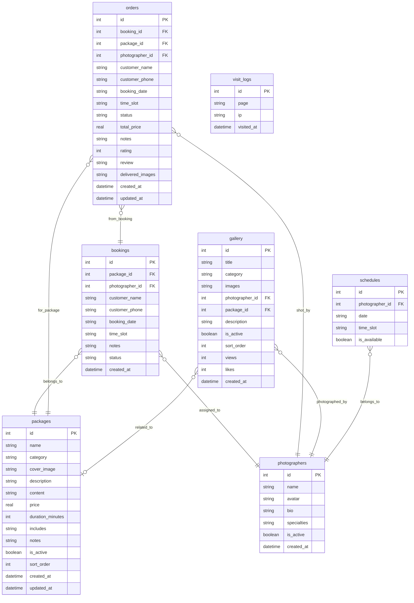

## 1. 架构设计

```mermaid
graph TB
    subgraph "前端层 (Port 3711)"
        "React + Vite" --> "客户端路由"
        "客户端路由" --> "首页"
        "客户端路由" --> "套餐页"
        "客户端路由" --> "预约页"
        "客户端路由" --> "订单页"
        "客户端路由" --> "图集页"
        "客户端路由" --> "后台管理"
    end
    subgraph "后端层 (Port 8711)"
        "Express API" --> "套餐服务"
        "Express API" --> "预约服务"
        "Express API" --> "订单服务"
        "Express API" --> "摄影师服务"
        "Express API" --> "作品服务"
        "Express API" --> "统计服务"
    end
    subgraph "数据层"
        "SQLite 数据库" --> "套餐/订单/预约表"
        "文件系统" --> "素材目录"
    end
    "前端层" -->|"HTTP API"| "后端层"
    "后端层" -->|"SQL"| "SQLite 数据库"
    "后端层" -->|"读写"| "文件系统"
```

## 2. 技术说明

- **前端**: React@18 + TailwindCSS@3 + Vite，运行于 3711 端口
- **初始化工具**: Vite
- **后端**: Express@4 + better-sqlite3，运行于 8711 端口
- **数据库**: SQLite（数据文件独立存放于 `data/` 目录）
- **素材目录**: `uploads/` 目录存放作品图片、套餐封面等素材
- **前后端通信**: RESTful API，前端通过 proxy 代理访问后端

## 3. 路由定义

### 前端路由

| 路由 | 用途 |
|------|------|
| `/` | 首页，品牌展示与套餐推荐 |
| `/packages` | 套餐列表页，分类筛选 |
| `/packages/:id` | 套餐详情页 |
| `/booking` | 预约页面 |
| `/orders` | 我的订单列表 |
| `/orders/:id` | 订单详情页 |
| `/gallery` | 作品图集页 |
| `/admin` | 后台管理首页（数据统计） |
| `/admin/packages` | 后台-套餐管理 |
| `/admin/photographers` | 后台-摄影师管理 |
| `/admin/orders` | 后台-订单管理 |
| `/admin/gallery` | 后台-作品管理 |
| `/admin/stats` | 后台-数据统计 |

## 4. API 定义

### 4.1 套餐模块

```typescript
interface Package {
  id: number
  name: string
  category: "portrait" | "outdoor" | "commercial"
  cover_image: string
  description: string
  content: string
  price: number
  duration_minutes: number
  includes: string
  notes: string
  is_active: boolean
  sort_order: number
  created_at: string
  updated_at: string
}

// GET    /api/packages          - 获取套餐列表（支持 ?category=portrait 筛选）
// GET    /api/packages/:id      - 获取套餐详情
// POST   /api/packages          - 创建套餐（管理员）
// PUT    /api/packages/:id      - 更新套餐（管理员）
// DELETE /api/packages/:id      - 删除套餐（管理员）
// PATCH  /api/packages/:id/toggle - 上架/下架切换（管理员）
```

### 4.2 摄影师模块

```typescript
interface Photographer {
  id: number
  name: string
  avatar: string
  bio: string
  specialties: string
  is_active: boolean
  created_at: string
}

// GET    /api/photographers       - 获取摄影师列表
// GET    /api/photographers/:id   - 获取摄影师详情
// POST   /api/photographers       - 创建摄影师（管理员）
// PUT    /api/photographers/:id   - 更新摄影师（管理员）
// DELETE /api/photographers/:id   - 删除摄影师（管理员）
```

### 4.3 档期模块

```typescript
interface Schedule {
  id: number
  photographer_id: number
  date: string
  time_slots: string
  is_available: boolean
}

// GET  /api/schedules?photographer_id=&date=   - 查询摄影师档期
// POST /api/schedules                          - 设置档期（管理员）
// PUT  /api/schedules/:id                      - 更新档期（管理员）
```

### 4.4 预约模块

```typescript
interface Booking {
  id: number
  package_id: number
  photographer_id: number
  customer_name: string
  customer_phone: string
  booking_date: string
  time_slot: string
  notes: string
  status: "pending" | "confirmed" | "conflict"
  created_at: string
}

// POST /api/bookings          - 创建预约（含冲突校验）
// GET  /api/bookings/check    - 校验时段是否可用
```

### 4.5 订单模块

```typescript
interface Order {
  id: number
  booking_id: number
  package_id: number
  photographer_id: number
  customer_name: string
  customer_phone: string
  booking_date: string
  time_slot: string
  status: "pending_confirm" | "shooting" | "delivered" | "completed" | "reschedule_requested" | "cancel_requested" | "cancelled"
  total_price: number
  notes: string
  rating: number | null
  review: string | null
  delivered_images: string | null
  created_at: string
  updated_at: string
}

// GET    /api/orders              - 获取订单列表（支持 ?status= 筛选）
// GET    /api/orders/:id          - 获取订单详情
// PATCH  /api/orders/:id/status   - 更新订单状态（管理员确认/交付等）
// POST   /api/orders/:id/reschedule - 申请改期
// POST   /api/orders/:id/cancel   - 申请退单
// POST   /api/orders/:id/review   - 提交评价
// POST   /api/orders/:id/deliver  - 成片交付（管理员）
```

### 4.6 作品模块

```typescript
interface GalleryItem {
  id: number
  title: string
  category: string
  images: string
  photographer_id: number
  package_id: number | null
  description: string
  is_active: boolean
  sort_order: number
  views: number
  likes: number
  created_at: string
}

// GET    /api/gallery              - 获取作品列表（支持 ?category= 筛选）
// GET    /api/gallery/:id          - 获取作品详情
// POST   /api/gallery              - 创建作品（管理员）
// PUT    /api/gallery/:id          - 更新作品（管理员）
// DELETE /api/gallery/:id          - 删除作品（管理员）
// PATCH  /api/gallery/:id/toggle   - 上架/下架
// POST   /api/gallery/:id/like     - 点赞
```

### 4.7 统计模块

```typescript
interface Stats {
  total_visits: number
  today_visits: number
  total_orders: number
  total_revenue: number
  orders_by_status: Record<string, number>
  recent_orders: Order[]
  monthly_revenue: { month: string; revenue: number }[]
}

// GET /api/stats/overview    - 获取总览数据
// GET /api/stats/visits      - 获取访客统计
// GET /api/stats/revenue     - 获取收入统计
```

## 5. 服务端架构图

```mermaid
graph LR
    subgraph "Controller 层"
        "packageController"
        "photographerController"
        "scheduleController"
        "bookingController"
        "orderController"
        "galleryController"
        "statsController"
    end
    subgraph "Service 层"
        "packageService"
        "photographerService"
        "scheduleService"
        "bookingService"
        "orderService"
        "galleryService"
        "statsService"
    end
    subgraph "Repository 层"
        "packageRepo"
        "photographerRepo"
        "scheduleRepo"
        "bookingRepo"
        "orderRepo"
        "galleryRepo"
        "statsRepo"
    end
    "Controller 层" --> "Service 层"
    "Service 层" --> "Repository 层"
    "Repository 层" --> "SQLite"
```

## 6. 数据模型

### 6.1 数据模型定义



### 6.2 数据定义语言

```sql
CREATE TABLE IF NOT EXISTS packages (
  id INTEGER PRIMARY KEY AUTOINCREMENT,
  name TEXT NOT NULL,
  category TEXT NOT NULL CHECK(category IN ('portrait', 'outdoor', 'commercial')),
  cover_image TEXT DEFAULT '',
  description TEXT DEFAULT '',
  content TEXT DEFAULT '',
  price REAL NOT NULL DEFAULT 0,
  duration_minutes INTEGER NOT NULL DEFAULT 60,
  includes TEXT DEFAULT '',
  notes TEXT DEFAULT '',
  is_active INTEGER NOT NULL DEFAULT 1,
  sort_order INTEGER NOT NULL DEFAULT 0,
  created_at TEXT DEFAULT (datetime('now', 'localtime')),
  updated_at TEXT DEFAULT (datetime('now', 'localtime'))
);

CREATE TABLE IF NOT EXISTS photographers (
  id INTEGER PRIMARY KEY AUTOINCREMENT,
  name TEXT NOT NULL,
  avatar TEXT DEFAULT '',
  bio TEXT DEFAULT '',
  specialties TEXT DEFAULT '',
  is_active INTEGER NOT NULL DEFAULT 1,
  created_at TEXT DEFAULT (datetime('now', 'localtime'))
);

CREATE TABLE IF NOT EXISTS schedules (
  id INTEGER PRIMARY KEY AUTOINCREMENT,
  photographer_id INTEGER NOT NULL,
  date TEXT NOT NULL,
  time_slot TEXT NOT NULL,
  is_available INTEGER NOT NULL DEFAULT 1,
  FOREIGN KEY (photographer_id) REFERENCES photographers(id) ON DELETE CASCADE,
  UNIQUE(photographer_id, date, time_slot)
);

CREATE TABLE IF NOT EXISTS bookings (
  id INTEGER PRIMARY KEY AUTOINCREMENT,
  package_id INTEGER NOT NULL,
  photographer_id INTEGER NOT NULL,
  customer_name TEXT NOT NULL,
  customer_phone TEXT NOT NULL,
  booking_date TEXT NOT NULL,
  time_slot TEXT NOT NULL,
  notes TEXT DEFAULT '',
  status TEXT NOT NULL DEFAULT 'pending' CHECK(status IN ('pending', 'confirmed', 'conflict')),
  created_at TEXT DEFAULT (datetime('now', 'localtime')),
  FOREIGN KEY (package_id) REFERENCES packages(id),
  FOREIGN KEY (photographer_id) REFERENCES photographers(id)
);

CREATE TABLE IF NOT EXISTS orders (
  id INTEGER PRIMARY KEY AUTOINCREMENT,
  booking_id INTEGER NOT NULL,
  package_id INTEGER NOT NULL,
  photographer_id INTEGER NOT NULL,
  customer_name TEXT NOT NULL,
  customer_phone TEXT NOT NULL,
  booking_date TEXT NOT NULL,
  time_slot TEXT NOT NULL,
  status TEXT NOT NULL DEFAULT 'pending_confirm' CHECK(status IN ('pending_confirm', 'shooting', 'delivered', 'completed', 'reschedule_requested', 'cancel_requested', 'cancelled')),
  total_price REAL NOT NULL DEFAULT 0,
  notes TEXT DEFAULT '',
  rating INTEGER DEFAULT NULL,
  review TEXT DEFAULT NULL,
  delivered_images TEXT DEFAULT NULL,
  created_at TEXT DEFAULT (datetime('now', 'localtime')),
  updated_at TEXT DEFAULT (datetime('now', 'localtime')),
  FOREIGN KEY (booking_id) REFERENCES bookings(id),
  FOREIGN KEY (package_id) REFERENCES packages(id),
  FOREIGN KEY (photographer_id) REFERENCES photographers(id)
);

CREATE TABLE IF NOT EXISTS gallery (
  id INTEGER PRIMARY KEY AUTOINCREMENT,
  title TEXT NOT NULL,
  category TEXT NOT NULL DEFAULT 'portrait',
  images TEXT NOT NULL DEFAULT '[]',
  photographer_id INTEGER NOT NULL,
  package_id INTEGER DEFAULT NULL,
  description TEXT DEFAULT '',
  is_active INTEGER NOT NULL DEFAULT 1,
  sort_order INTEGER NOT NULL DEFAULT 0,
  views INTEGER NOT NULL DEFAULT 0,
  likes INTEGER NOT NULL DEFAULT 0,
  created_at TEXT DEFAULT (datetime('now', 'localtime')),
  FOREIGN KEY (photographer_id) REFERENCES photographers(id),
  FOREIGN KEY (package_id) REFERENCES packages(id)
);

CREATE TABLE IF NOT EXISTS visit_logs (
  id INTEGER PRIMARY KEY AUTOINCREMENT,
  page TEXT NOT NULL,
  ip TEXT DEFAULT '',
  visited_at TEXT DEFAULT (datetime('now', 'localtime'))
);

CREATE INDEX IF NOT EXISTS idx_packages_category ON packages(category);
CREATE INDEX IF NOT EXISTS idx_packages_active ON packages(is_active);
CREATE INDEX IF NOT EXISTS idx_schedules_photographer_date ON schedules(photographer_id, date);
CREATE INDEX IF NOT EXISTS idx_bookings_photographer_date ON bookings(photographer_id, booking_date);
CREATE INDEX IF NOT EXISTS idx_orders_status ON orders(status);
CREATE INDEX IF NOT EXISTS idx_orders_customer_phone ON orders(customer_phone);
CREATE INDEX IF NOT EXISTS idx_gallery_category ON gallery(category);
CREATE INDEX IF NOT EXISTS idx_gallery_active ON gallery(is_active);
CREATE INDEX IF NOT EXISTS idx_visit_logs_page ON visit_logs(page);
CREATE INDEX IF NOT EXISTS idx_visit_logs_visited_at ON visit_logs(visited_at);
```

## 7. 目录结构

```
lp0051/
├── server/                  # 后端服务
│   ├── index.js            # 入口文件
│   ├── db/                 # 数据库
│   │   ├── init.js         # 初始化脚本
│   │   └── seed.js         # 种子数据
│   ├── routes/             # 路由
│   │   ├── packages.js
│   │   ├── photographers.js
│   │   ├── schedules.js
│   │   ├── bookings.js
│   │   ├── orders.js
│   │   ├── gallery.js
│   │   └── stats.js
│   ├── middleware/          # 中间件
│   │   └── upload.js
│   └── package.json
├── client/                  # 前端应用
│   ├── src/
│   │   ├── components/     # 通用组件
│   │   ├── pages/          # 页面组件
│   │   ├── api/            # API 请求
│   │   ├── hooks/          # 自定义 hooks
│   │   ├── App.jsx
│   │   └── main.jsx
│   ├── index.html
│   ├── vite.config.js
│   ├── tailwind.config.js
│   └── package.json
├── data/                    # 数据目录（SQLite 文件）
├── uploads/                 # 素材目录（图片文件）
└── .trae/                   # 文档目录
```
